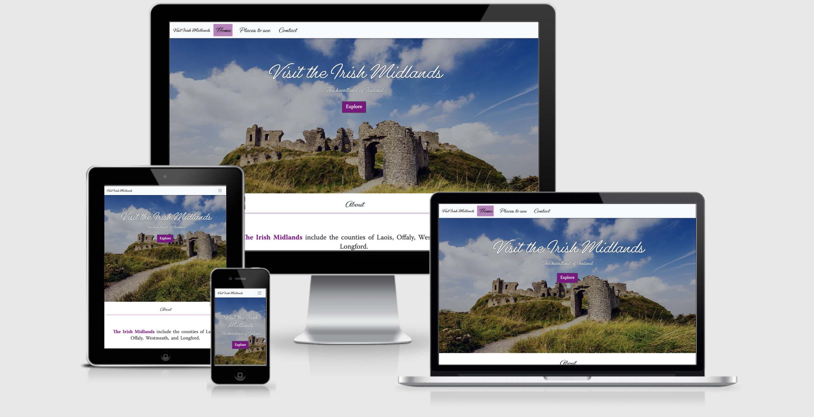

# Visit Irish Midlands

Visit Irish Midlands gives information about places to visit in the Irish Midlands. 

## User Experience (UX) 
### Strategy

### Ideal user demographic
The ideal user of this website is:
* a resident of the counties of Laois, Offaly, Westmeath, or Longford;
* a visitor or potential visitor to those counties; 

### User stories
* As a resident, visitor, or potential visitor, I want to navigate easily through the website to find relevant information.

### Site owner
* As the site owner, I want to highlight local tourist attractions to the users.

### Scope
**What a user will expect**

* A website that is easy to navigate.
* Visually appealing regardless of screen size.
* Links and functions work as expected. 
* Information about attraction in the Irish Midlands.
* A way to contact the site owner.

**What a user may want** 
* To find links to social media pages.
* To see images of the locations.

**As a developer/ organisation I expect**

* To provide information about the town of Portarlington, its shops, and services.
* To provide an easy way for users to contact me.
* To provide a website that is easy to navigate and with links that work. 

Note Not all of What the user may want will be implemented at this stage. 
Additional features may be implemented in due course. 
### Structure 
The site has three pages 
* Visit Irish Midlands
* Things to see
* Contact page

### Skeleton
When creating the website, I used responsive design. When the site is expanded from a mobile, stacked elements will display in two columns in each row, this means that more of the website can be seen at once. 

## pages
### Home page
This page has a large image of local scenery with an about section, then an explore section. It was planned to have a Google map below this but unfortunately, I have been unable to get this to work. I did get it working in jsfiddle.net but not when I transferred it to actual site. 

### Places to see
This page has three sections: 
* Forests & Woodlands
* Visitor Centres
* Historical sites

These three sections each have three information cards. 

### Contact 
A contact form is provided. I had hoped to get this to work as well, but I ran out of time. 

## Design
### Colour
The main highlight colour is "Purple". 

### Typography
#### Headings and menus
The heading font is [Gautreaux](https://fonts.adobe.com/fonts/gautreaux) typeface. 

#### Body text and menus 
The [Warnock](https://fonts.adobe.com/fonts/warnock) typeface is used for body text. When choosing the font, particular care was taken to ensure that ≪Old Style≫ numbers were available.

### Continuity 
The page is designed to be user-friendly. The same templates are used on each page with similar headers and footers. This should make it easy and accessible for each user.

## Technologies used 
### Languages used

 
 

### Frameworks, libraries, and programs used:
* [Am I responsive](http://ami.responsivedesign.is/)
    - Used to create mockup of the information page for the README.md.
* [Bootstrap4](https://getbootstrap.com) 
    - This framework was used to ensure all pages were responsive across all devices.
* [Font Awesome](https://fontawesome.com) 
    - Using well-known icons to highlight text throughout the site, to enhance the user experience.
* [Git](https://git-scm.com/) 
    - Used via the [Gitpod](https://gitpod.io) platform to create, commit, and push changes in the code to GitHub.
* [GitHub](https://github.com) 
    - Project stored in a repository and to incorporate changes made using Git. Also used for deployment via GitHub Pages. 
* [Tinypng](https://www.tinypng.com) 
    - Used to reduce images in size to aid loading on site. 
* [Typekit](https://fonts.adobe.com/) 
    - Used to source typefaces to complement each other.

## Acknowledgements
### Photographs
The photographs used in the site are from various sites online. 

## Features
The site shows three types of attractions that visitors may want to see while in the Irish Midlands. Information is shown on the **Places to see** page with short snippets highlighted on the map on the homepage. 

### Existing features

### Future features 

## Tools used
https://jsfiddle.net/ to help write the JavaScript
